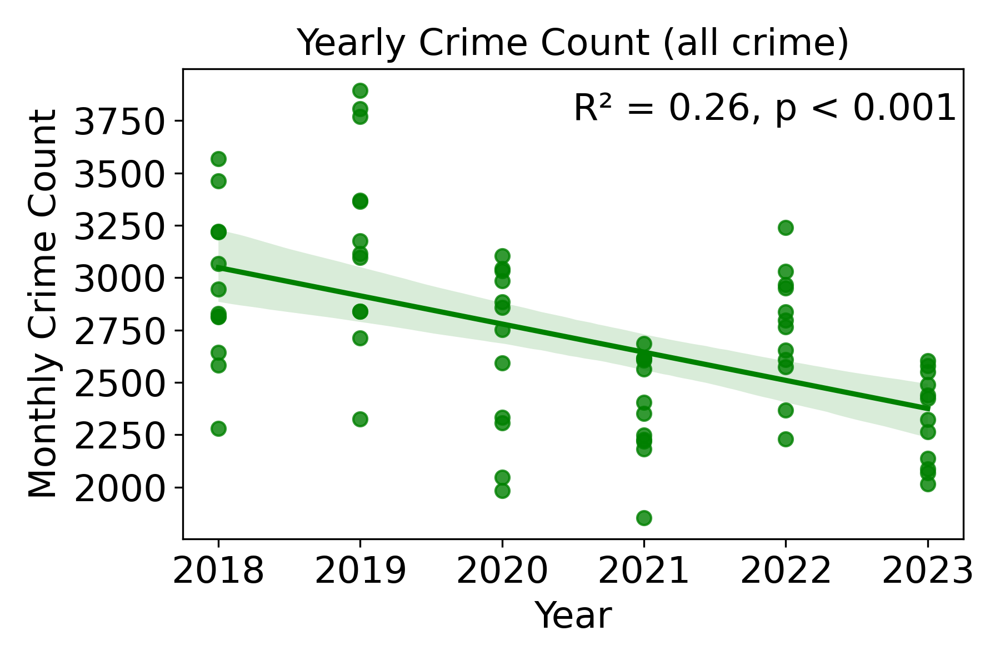

<!-- # Calgary Transit Project -->

## Background

The City of Calgary collects, analyzes, and publishes data related to a variety of aspects of quality of life. One Department that contributes to the **Open Data Project**
is Calgary Transit. Analyses of the annual and semi-season surveys are published on their [website](https://www.calgary.ca/research/satisfaction-survey.html). 

The most recent surveys from spring [2024](https://www.calgary.ca/content/dam/www/cfod/csc/documents/cit-sat/2024-Spring-Survey-of-Calgarians-Final-Report.pdf) and fall [2023](https://www.calgary.ca/content/dam/www/cfod/csc/documents/cit-sat/cit-sat-2023/2023-fall-survey-of-calgarians.pdf) revealed that one of Calgary's top issues in need of improvement is related to transit. Other mentioned issues were traffic/infrastructure, crime, homelessness/poverty, and economy.

Overall Calgarians rank transit and accessibility to transit as very important and wish to see more of the city's investments to go towards Transit improvements. A staggering 92% of Calgarians would like to see increased investment to "address transit safety issues" in fall 2023.

In this project, I aim to get to know Calgary's Transit system as I am a big fan of public transport myself and will be moving to Calgary soon. Moreover, I would like to see if I can find indications for why Calgarians feel this need for increased safety on Transit.

 

### Map of Transit Routes in Calgary

On first glance this map of all Transit Routes in Calgary shows an impressive coverage of all of Calgary's wards.

  <iframe src="https://tatjana.golovin.de/wp-content/uploads/2024/06/calgary_transit_routes_map_with_legend-1.html" width="600" height="400" style="border:none;"></iframe>

 <figcaption style="text-align: center; margin-top: 10px;">
        Figure 1: Overview of all Calgary Transit Routes in June 2024.
    </figcaption>

 

## What can we learn about Transit ridership?

### Ridership numbers

Data collected from 2010 until 2023 (2024 excluded since incomplete) shows a yearly increase in ridership until reaching a plateau in 2014, followed by a drop in ridership starting in 2016. Ridership numbers started to recover in 2017 and reached an all time low in 2020, which was clearly pandemic related. Ever since then, ridership numbers have been on the incline, but haven't reached levels from 2014 to 2019, yet.

 <figcaption style="text-align: center; margin-top: 10px;">
        Figure 2: Seasonal and yearly trends in ridership from 2010 to 2023 show steady levels until 2020.
    </figcaption>

### Ticket popularity
Not surprisingly, as the largest demographic, adults, buy the most tickets and make the largest proportion in ridership when comparing age group. The two largest ticket type groups are monthly passes (adults and youth).

    <!-- First row of images -->
    

        <figure style="display: inline-block; margin: 0;">
            <figcaption style="text-align: left;">A</figcaption>
            
        </figure>
        <figure style="display: inline-block; margin: 0;">
            <figcaption style="text-align: left;">B</figcaption>
            
        </figure>
    

 <figcaption style="text-align: center; margin-top: 10px;">
        Figure 3: Popularity of different riderships and average ridership proportion per age group. (A) Total ridership numbers over the years for all ridership categories. (B) Average ridership proportion per age group.
    </figcaption>

 

 

## Is crime on the rise in Calgary in general?

Community Crime Statistics data reveal that overall reported crime counts slowly but significantly decreased from 2018 to 2023 (Figure 4A). Seasonal stratification shows that  pre-pandemic `Summer` and `Fall` were seasons with higher crime counts and that around the time of the pandemic crime total numbers dropped and remained lower even post-pandemic (Figure 4C).

Crime counts of the categories `Assault (Non-domestic)` or `Violence\xa0 'Other' (Non-domestic)` (termed "Violent" here) are unfortunately consistently on the rise (Figure 4B). Although in 2020 total crime counts, driven by particularly low numbers in `Spring` of 2020, decreased, violent crimes counts recovered to pre-pandemic levels in Summer of 2020 and are still rising (Figure 4D).

    <!-- First row of images -->
    

        <figure style="display: inline-block; margin: 0;">
            <figcaption style="text-align: left;">A</figcaption>
            
        </figure>
        <figure style="display: inline-block; margin: 0;">
            <figcaption style="text-align: left;">B</figcaption>
            
        </figure>
    

     
    <!-- Second row of images -->
    

        <figure style="display: inline-block; margin: 0;">
            <figcaption style="text-align:  left;">C</figcaption>
            
        </figure>
        <figure style="display: inline-block; margin: 0;">
            <figcaption style="text-align: left;">D</figcaption>
            
        </figure>
    

     
    <!-- Figure caption -->
    <figcaption style="text-align: center; margin-top: 10px;">
        Figure 4 : Overall crime levels decreased in Calgary from 2018 to 2023 but violent crimes increased. (A) Besides a peak in overall crime rates in 2019 which occured predominantly in spring and summer (C), yearly total crime counts are on a decline since 2018. (B) Violent crime counts, however, increase since 2018, without a clear seasonal effect (note slightly higher violent crime counts in summer overall) (D).
    </figcaption>

<!-- 
 -->

 

## Could the rise in overall violent crime be linked to a growing demand for increased safety in public transit?

Calgary Transit collects data on calls received by the Transit Peace Officer. Those include anything from reporting of accidents to violent crime by the public, transit officials or the police. The vast majority of reporting for the years 2014 to 2017 was done by officals and not the public. When inspecting only categories of reported `crimes` or `disturbances` (which might weight in to the public's opinion about safety on Transit as well), counts remain steady for all reports (including the public; Figure 5A, C). Both Figure 5A and C show that there is neither an up- or downward trend for this time span. The reporting of `crimes` or `disturbances` by the public, however, increased significantly over the years, with no clear season as the main driver of this trend (Figure 5B, D). 

<!-- 

    

     
     
     

     
     
     

 -->

    <!-- First row of images -->
    

        <figure style="display: inline-block; margin: 0;">
            <figcaption style="text-align: left;">A</figcaption>
            
        </figure>
        <figure style="display: inline-block; margin: 0;">
            <figcaption style="text-align: left;">B</figcaption>
            
        </figure>
    

     
    <!-- Second row of images -->
    

        <figure style="display: inline-block; margin: 0;">
            <figcaption style="text-align: left;">C</figcaption>
            
        </figure>
        <figure style="display: inline-block; margin: 0;">
            <figcaption style="text-align: left;">D</figcaption>
            
        </figure>
    

     
    <!-- Figure caption -->
    <figcaption style="text-align: center; margin-top: 10px;">
        Figure 5: Reports of calls to Transit Peace Officer no increase in reports by everyone, however, calls by the public alone significantly increased from 2014 to 2017. (A) Calls to the Transit Peace Officer were consistent without any consistent seasonaly effect for these years (C). (B) Calls made by the public alone, however, increased every year, again without a seasonal effect (D).
    </figcaption>

<!-- 
 -->

 

## Conclusion and Outlook

While Calgary Transit should strive to increase safety of their riders when using the transit system, they need to be conscientious of how this is achieved. Although,  total crime counts are on the decline, violent crime counts increase. This is also (almost) a mirror reflection of crime/disturbance reports to the Transit Peace Officer by the public.

+ Increasing saftey measures should:
    + achieve a feeling of safety when using the transit system, which is especially important for the ridership dependent on public transport
    + focus on prevention of violent crime, other crime, and disturbances 

+ Action steps coul be: 
    + increased CCTV coverage and indication of it on the transit system and at stations
    + increased presence of security personell at bus/train stations
    + increased presence of security personell in busses/trains
    + reporting should be made even more accessible, such as via text messaging, and strongly advertised

 

### Downside of the analysis and future directions
The analyzed time ranges are variable and gathering more data to fill the gaps would be desireable. The reporting of Transit Peace Officer calls was limited to the years 2014 to 2017 and can only be used as early indicator. That being said, there might be data/analyses done by the Calgary Open Data team for these years. It would be interesting to see if Transit Safety was a top concern for Calgarians back then, too.

 

# Data License/Attribution

Data for this project was collected from [Calgary Open Data Portal](https://data.calgary.ca/) and contains information licensed under the Open Government Licence – City of Calgary.

